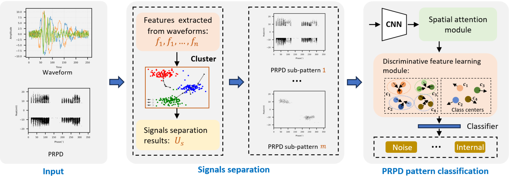

# PD-Detection-Noise-Seperation

[`Paper`](https://ieeexplore.ieee.org/abstract/document/10569991/)

This repository contains the codes for our IEEE Transactions on Industrial Informatics paper. For more details, please refer to the paper [Noise Separation and Discriminative Feature Learning for PD Classification](https://ieeexplore.ieee.org/abstract/document/10569991/)

Features
1. Efficient feature extraction for separating the PD and noise
2. KMeans based clustering and sub PRPD patterns generation
3. Noise-PD seperation based PD recognition using the CNN model

## Abstract
Developing intelligent methods for Partial Discharge (PD) diagnosis, capable of handling various types of insulation defects in switchgear, has garnered significant attention in recent years. Certain PD signals exhibit similar characteristics, often leading to their confusion with noisy signals during data acquisition. To mitigate noise interference and enhance the precision of PD recognition, this paper introduces a novel framework for separating PD signals from noise and acquiring discriminative features for identifying different types of PDs. Specifically, the proposed approach incorporates an adaptive frequency sampling strategy to extract effective and efficient features for the separation of PD signals and noise, followed by the clustering of the captured signals. Phase Resolved Partial Discharge (PRPD) patterns are then generated for each
clustered signal group, forming the PRPD pattern database. In order to identify the informative region within the PRPD patterns, we introduce spatial correlation attention and discriminative feature learning modules. These modules aim to reduce intra-class variance and increase inter-class differences in the PRPD patterns. To evaluate the effectiveness of the proposed method in separating PD signals from noise and recognizing different PD patterns, we constructed a PD recognition dataset that encompasses noise as well as three types of PDs: corona, internal, and surface. By conducting experiments and comparing the results with
state-of-the-art methods, we demonstrate the performance of our method in achieving accurate PD recognition.

## Method Overview


## Requirements

For running the code:

- [Python 3.12.x](https://www.python.org/)
 
- [NumPy](https://numpy.org/)
 
- [SciPy](https://scipy.org/)
 
- [Matplotlib](https://matplotlib.org/)
 
- [Kneed](https://pypi.org/project/kneed/) 

- [Scikit-learn](https://scikit-learn.org/stable/) 

- [Pytorch](https://pytorch.org/) 


## Setup

1. Clone this repo.

   ```terminal
   git clone https://github.com/jinsheng-ji/PD-Detection-Noise-Seperation.git
   ```


2. Install the required libraries.

- using conda :

  ```terminal
  conda env create -n pd python=3.10
  ```
 
- using pip :

  ```terminal
  pip install -r requirements.txt
  ```

3. Execute python script.

- PD-noise seperation :

```terminal
  python pd_noise_seperation.py
```

- Train CNN model :

```terminal
  python pd_recognition_train.py
```

## Getting Started

This repository is organized in two parts: pd_noise_seperation.py and pd_recognition_train.py codes for seperating the PD-noise and training the PD recognition model. Below are the instructions for training and visualizing the results.


1. PD-noise seperation.
```
python pd_noise_seperation.py
```
2. Visualization the results.
```
python pd_noise_seperation.py
```
3. Train a PD recognition model.
```
python pd_recognition_train.py
```
## Defined PD types and edge-computing based PD detector


## License 

MIT

## Citation
If you find the codes or paper useful for your research, please cite our paper:
```bibtex
@ARTICLE{10569991,
  author={Ji, Jinsheng and Shu, Zhou and Wang, Wensong and Li, Hongqun and Lai, Kai Xian and Zheng, Yuanjin and Jiang, Xudong},
  journal={IEEE Transactions on Industrial Informatics}, 
  title={Noise Separation and Discriminative Feature Learning for Partial Discharge Recognition}, 
  year={2024},
  volume={20},
  number={10},
  pages={11774-11784},
  doi={10.1109/TII.2024.3413307}}
```

